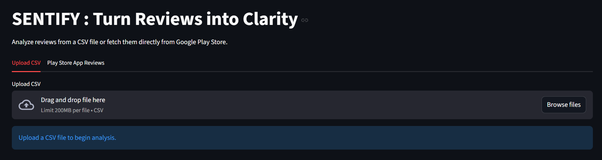
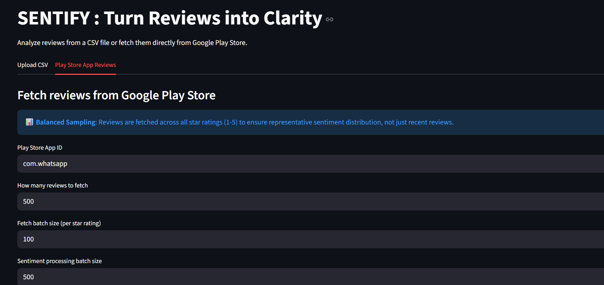
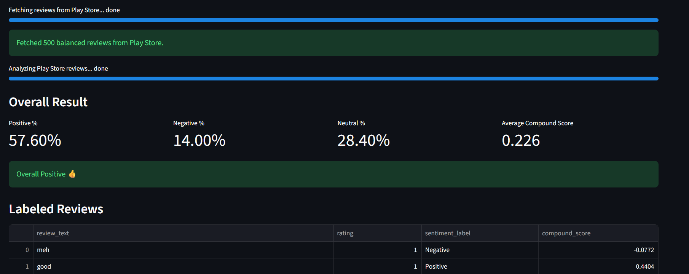

# SENTIFY - TURN REVIEWS INTO CLARITY

SENTIFY is a Streamlit app that can either read a CSV file of reviews or fetch Google Play Store reviews by app ID, label each review as **Positive**, **Negative**, or **Neutral** using VADER, and show overall sentiment percentages.

## Features

- Upload a CSV file
- Select the review text column
- Fetch Play Store reviews using app ID (no API key)
- **Stratified sampling**: Reviews fetched across all star ratings (1-5) for balanced sentiment representation
- Batch fetch and batch sentiment processing with live progress bars
- Per-review sentiment label and compound score
- Overall Positive/Negative/Neutral percentage summary
- Final verdict based on dominant sentiment
- Download labeled CSV output with star ratings (Play Store mode)

## Tech Stack

- Python
- Streamlit
- Pandas
- vaderSentiment (VADER)
- google-play-scraper

## Installation

```bash
pip install -r requirements.txt
```

## Run

```bash
streamlit run app.py
```

## UI Preview

### CSV Review Analysis



### Play Store Review Analysis





## Input format

- CSV with at least one column containing review text
- Choose that column in the app UI
- For Play Store mode, provide app ID (example: `com.whatsapp`)

## Why Stratified Sampling?

When fetching Play Store reviews, SENTIFY uses **stratified sampling** by fetching reviews across all 5 star ratings (1-5 stars) instead of just the newest reviews. This ensures:
- Balanced representation of negative, neutral, and positive reviews
- More accurate overall sentiment analysis
- True reflection of the app's actual sentiment distribution


## Need for this project

- Helps app teams monitor user satisfaction continuously from real reviews.
- Detects post-release problems early (for example, crash complaints or UI friction) before ratings drop.
- Highlights what users love (such as easy UI or fast performance) to guide product, roadmap, and marketing decisions.
- Supports growth by improving review quality insights, protecting ratings, and helping teams prioritize high-impact fixes.
- Aligns with industry-standard review intelligence workflows used by tools like Appbot, Apptweak, and Sensor Tower.

## 🛠️ Contributing

Contributions to SENTIFY are highly encouraged. Whether it is code improvements, bug fixes, documentation updates, or feature enhancements, feel free to contribute to the project repository.

## 📜 License

SENTIFY is licensed under the MIT License, granting you the freedom to use, modify, and distribute the code in accordance with the terms of the license.